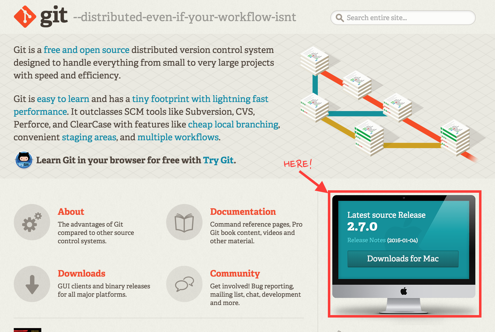
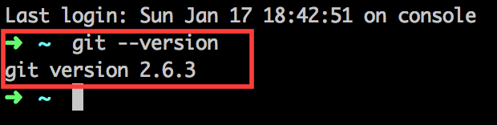
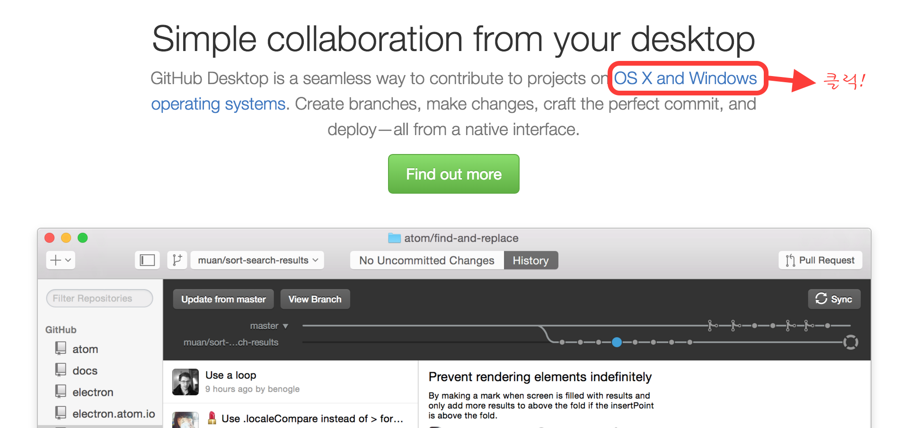
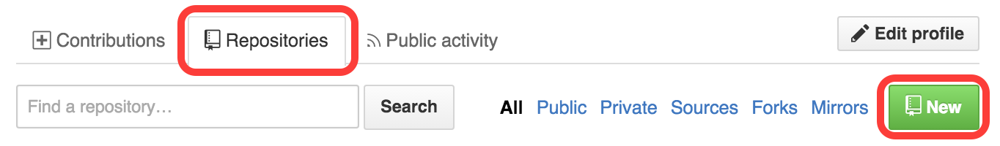
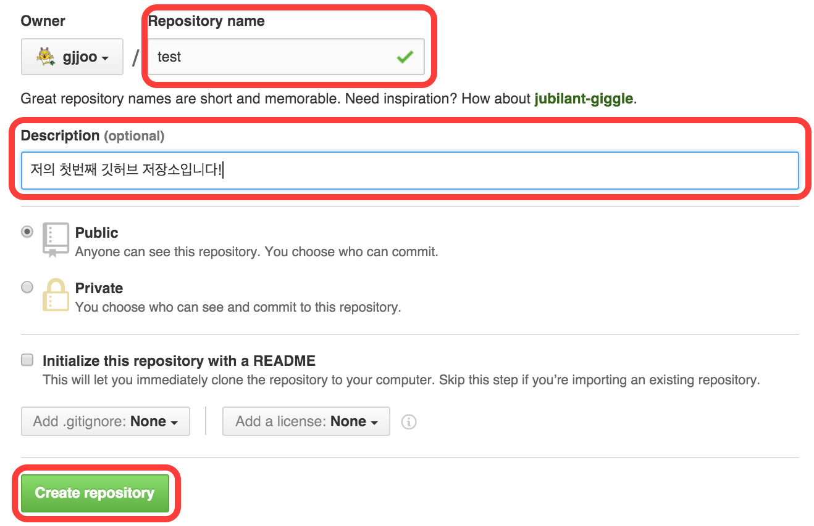
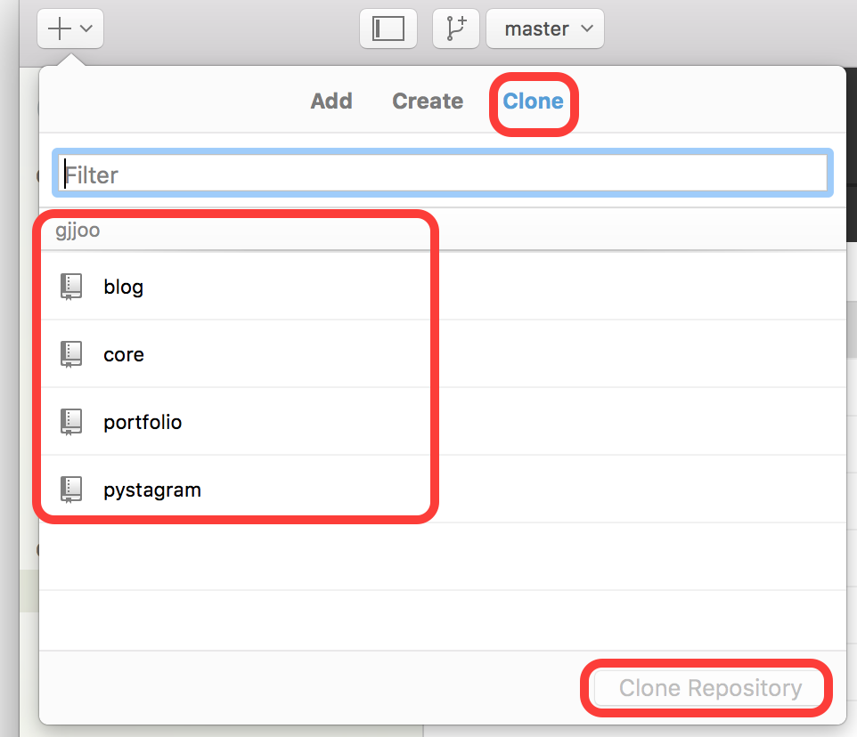

# Git & Github & Markdown

## 프로젝트 버전관리 시스템 
- Git 
- SVN
- CVS 

## Git
소스 코드 관리를 위한 분산 버전 관리 시스템 으로 빠른 속도에 중점을 두어 상대적으로 SVN, CVS보다 빠르다. 
SVN과 Git의 차이점은 SVN은 중앙 집중식 소스코드로 관리되는 반면에 Git은 분산 관리 방식이다. 
SVN은 중앙 저장소에 인터넷연결이 되어있지 않거나, 자료가 소실 되었을 경우 복원할 수 없지만 Git은 개인 로컬 저장소에 history가 관리 되기 때문에 복원이 가능하다.

프로젝트 버전 관리 시스템은 개발자 뿐만 아니라 웹디자이너, 웹퍼블리셔 모든 대상에게 필요한 시스템으로 국내에서는 SVN이 개발자들의 고유 도구였지만 최근에는 Git 사용자가 많아짐에 따라서 각 분야 전문가들의 원만한 협업을 위해 사용하고 있으며 필수적으로 자리잡고 있다. 

- Github : Git GUI(Graphic User Interface)
- GitPages : Github의 Repositories를 이용하여 웹서버 사용
- Gist : 파일 단위의 스나펫 관리
- GitBook : Markdown을 이용하여 개발문서 또는 책 제작 

**참고 자료**
 - [Git Book 한국어](https://git-scm.com/book/ko/v2) : Git에 대한 자세한 내용

 

### Git 설치
[Git 다운로드](https://git-scm.com) 
- Mac Os의 경우 dmg 파일로서 실행하여 따로 설치하지 않아도 된다.

 

### Git 버전확인
Git 설치 후 확인 
- Mac : Terminal 에서 `git --version` 입력. 
- window : 'Git-Bash' 실행 하여 `git --version` 입력.

 

## Github
Git을 이용하여 사용자에게 GUI(Graphic User System)을 제공하는 오픈소스이며, `public`이 아닌 `private`을 이용하려면 별도의 요금이 필요하다. 해외의 모든 프로젝트는 Github를 이용한다는 말이 있을 정도로 그만큼 많은 기업들이 오픈프로젝트에 Github를 사용하고 있다.

 

### Github 설치
[Github 다운로드](https://www.github.com)

 

### 저장소 만들기
**1. Github 사이트에서 만들기**
1) your profile[우측상단] > Repositories 탭에서 `NEW` 버튼 클릭!
2) 저장소 이름과 설명을 입력하고 `Create repository` 클릭!
3) `Local Application`으로 돌아간 후 `Clone 탭`에서 생성한 저장소를 `Clone Repository`

> 

***
> 

***
> 

**2. `Github Local Application`에서 만들기**

