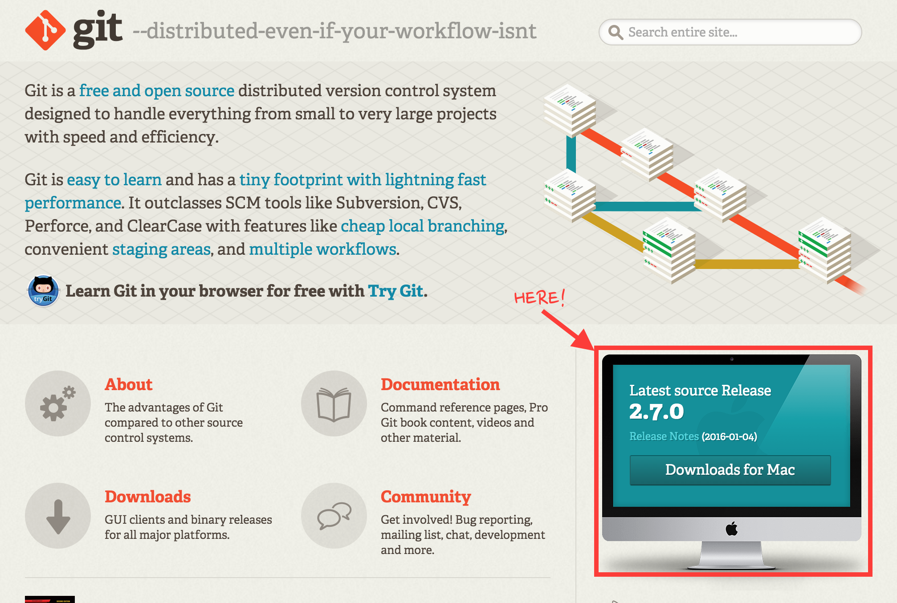

# Github & GitPages & Gist & GitBook

## [Github](https://github.com/)
- Create
- Clone
- Publish
- Sync
- Commit
- Undo
- History
- Branch

_Create Branch_

## [GitPages](https://pages.github.com/)
Github의 Repositories를 이용하여 Github 2차 도메인을 사용할 수 있다. 

## [Gist](https://gist.github.com/discover)
Github는 프로젝트 단위로 파일들을 관리, Gist는 파일 단위로 코드 관리 

## [GitBook](https://www.gitbook.com/)
Markdown을 이용하여 개발문서, API 등을 제작할 수 있으며 `Github의 GitPages`처럼 도메인을 제공하여 실시간으로 웹에서도 작성이 가능하다. 

